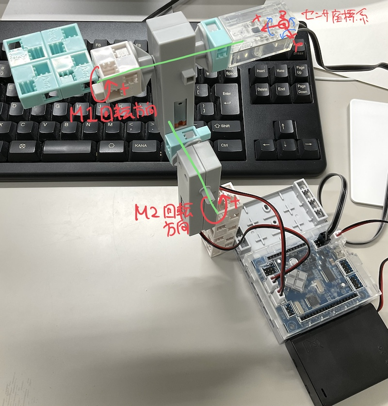

# Studuinoでジンバルっぽいもの

アーテック社のArduino互換基板[Studuino](https://www.artec-kk.co.jp/studuino/ja/)を使ったジンバルっぽいもの．

## 必要なもの

* Studuino
* DCモータブロック x 2
* 加速度ジャイロセンサ（センサー部品 MPU-6050）
* センサー接続ケーブル（長）
* 電池ボックス（単3 x 3本）
* ブロック 適量

## 使い方

### ハードウェアの準備

画像のように組み立てる．

### ソフトウェアの準備
1. [Arduino IDE](https://www.arduino.cc/en/software)をインストール
1. [アーテック社のページ](https://www.artec-kk.co.jp/studuino/ja/arduino.php)からStuduinoライブラリセット，ハードウェア設定ファイルをダウンロードして，当該ページの指示どおり配置する
1. Arduino IDEでのボード設定についても当該ページの指示どおり行う
1. Arduino IDEでスケッチ[gimbal.ino](gimbal/gimbal.ino)を開き，書き込む